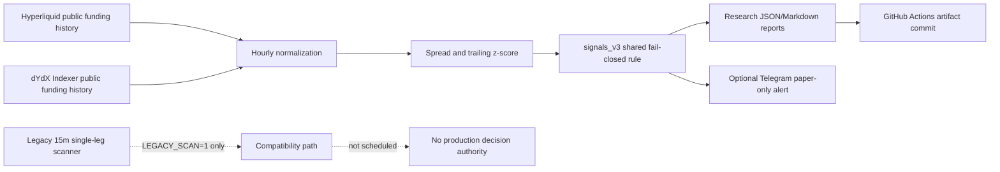

# Architecture

The scheduled path is intentionally **read-only**. The only authoritative decision function is `signals_v3.evaluate_divergence()`, which requires valid funding observations, sufficient history, an extreme z-score, and a buffered expected-funding-cost gate. It returns a paper candidate with two conceptual venue legs; it does not generate a stop, take-profit, leverage, margin, or order payload.

Historical data is aligned to hourly bins using the common overlap only. The code does not forward-fill one venue across a missing observation from the other venue. dYdX responses are checked for expected fields and paginated backward through `effectiveBeforeOrAt`; Hyperliquid timestamps are normalized before cursor arithmetic.

The current paper database models a single directional instrument and is therefore not used to represent a paired funding candidate. This separation prevents a misleading one-leg PnL record from being interpreted as a delta-neutral result.
